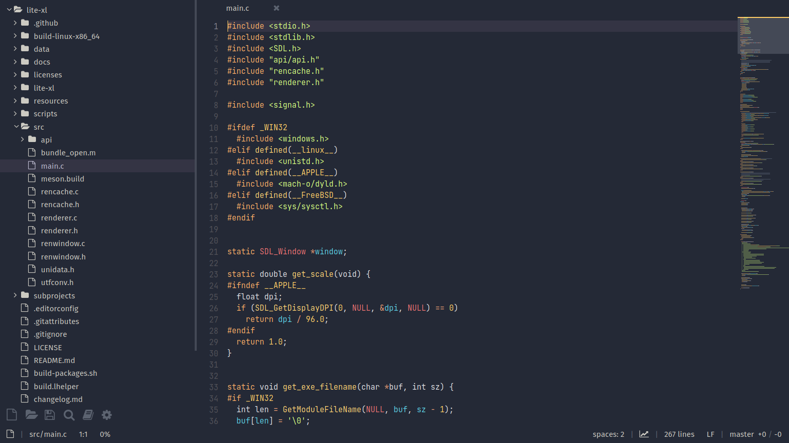
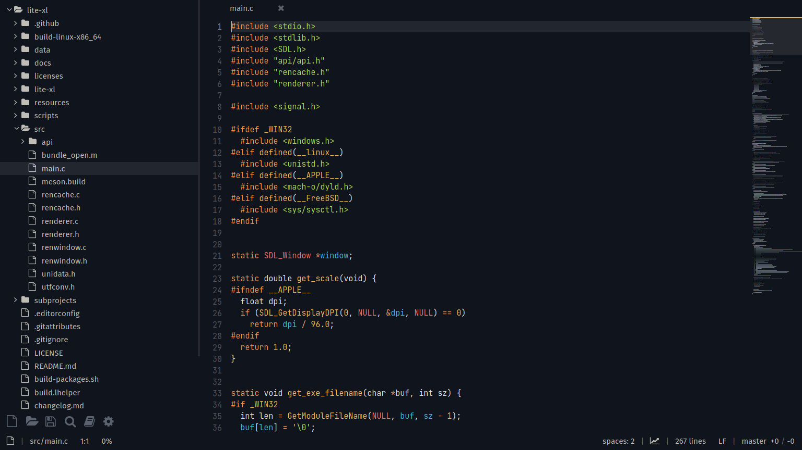

A port of the beautiful [dempfi's Ayu Theme](https://github.com/dempfi/ayu) for Lite XL.

> `ayu` is a simple theme with bright colors and comes in three versions — *dark*, *mirage* and *light* for all day long comfortable work.

## Instalation
Clone this repository to your local directory, then copy the contents of `colors` directory to `LITE_XL_CONFIG_DIR/colors` (in case of linux, this usually translates to `~/.config/lite-xl/colors`)

```
$ git clone https://github.com/juliardi/lite-xl-ayu-theme.git ayu-theme
$ cd ayu-theme
$ cp colors/* ~/.config/lite-xl/colors
```

## Preview
### Ayu Mirage


### Ayu Dark


### Ayu Light
